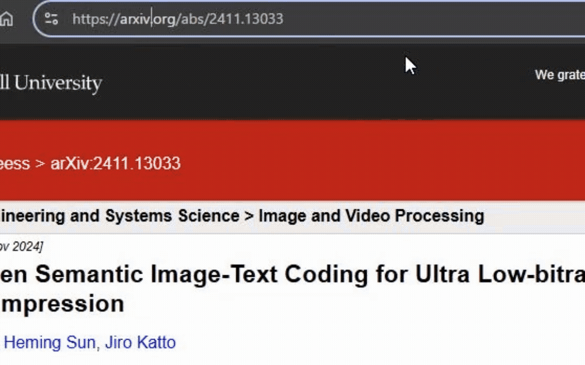

# arxivcite

[arxivcite](https://www.arxivcite.org/) is a simple tool to generate citations for arXiv papers in various formats. You can use it by changing the URL of an arXiv paper from `arxiv.org/pdf/...` to `arxivcite.org/pdf/...`.

